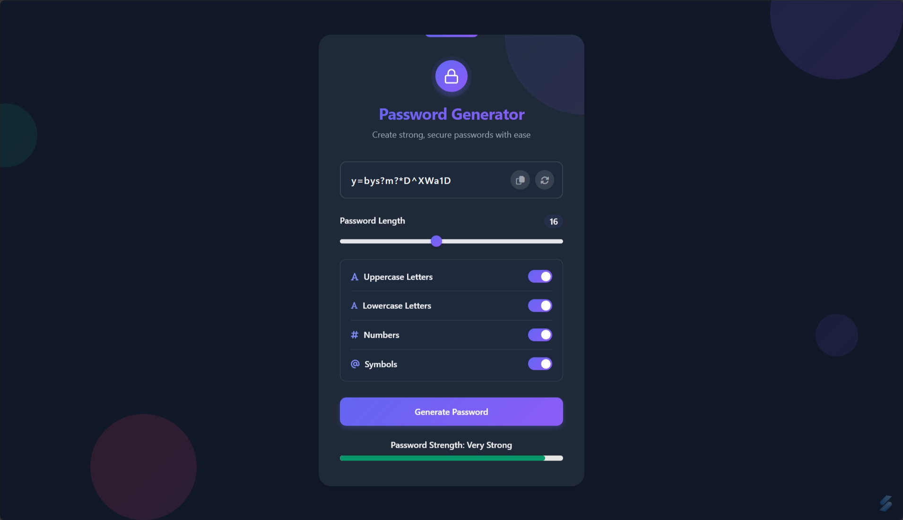

# 🔐 Password Generator

A modern, responsive, and customizable password generator built with HTML, CSS, and JavaScript.
This tool allows users to create secure passwords of varying lengths and complexity, with options for uppercase letters, lowercase letters, numbers, and symbols. It also includes a real-time strength meter, clipboard copy functionality, and stylish UI animations.

## ✨ Features

- ✅ Fully responsive and mobile-friendly UI
- 📏 Adjustable password length (4–32 characters)
- 🛠️ Customizable password options:
    - ✅ Uppercase Letters
    - ✅ Lowercase Letters
    - ✅ Numbers
    - ✅ Symbols
- 📊 Real-time strength indicator
- 📋 Clipboard copy button
- 🔄 Generate new password on refresh
- ⚡ Ripple animation & floating background elements
- 🌗 Light & dark mode support
- 🧠 Friendly error handling and notifications

## 🚀 Live Demo
👉 [**Try the Live Demo**](https://lorainecastro.github.io/password-generator/)